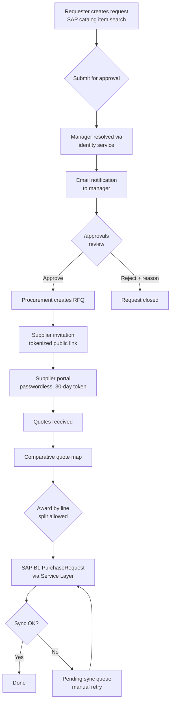
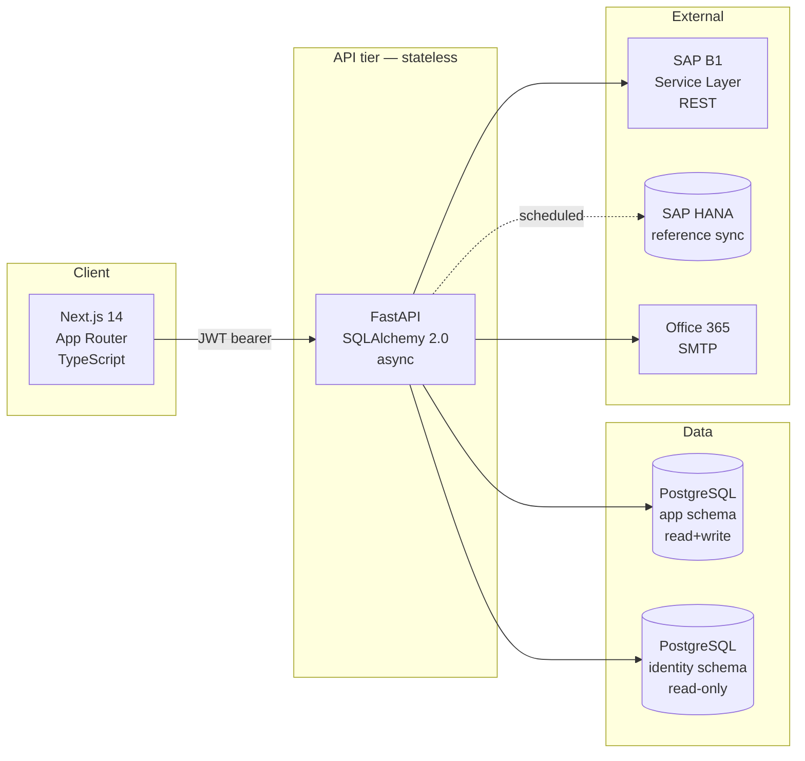

# Procure Platform — From Request to PO with ERP Sync

A reference architecture for a procurement platform that takes a purchase request through manager approval, supplier RFQ, comparative quote analysis, line-level award (with split support), and synchronization to **SAP Business One** as a `PurchaseRequest` — all wired into existing identity, ERP, and email infrastructure.

> **Note:** This repository documents the architecture and engineering patterns of a production system. The application source, business logic, and real datasets are kept in a separate private repository.

---

## Why this exists

Most procurement tooling falls into two camps: heavyweight enterprise procurement suites (Coupa, Ariba, Jaggaer — expensive, slow to customize, vendor lock-in) or generic form/workflow builders (cheap, but no real ERP integration and weak supplier-side UX).

Procure Platform demonstrates a third path — a code-first procurement engine that:

- **Plugs natively into SAP Business One** via the Service Layer REST API
- Treats supplier participation as **passwordless and frictionless** (tokenized public portal — no supplier accounts to manage)
- Supports **line-level award splitting** — multiple suppliers per RFQ, common in regulated and multi-category procurement
- Resolves approvers automatically from the existing **identity service** — no parallel hierarchy to maintain
- Recovers gracefully from ERP sync failures (idempotent retry with manual override)
- Costs nothing per seat

---

## Domain workflow

---

## Architecture

The API tier is **stateless**. State lives in Postgres, identity is delegated, and ERP data flows through SAP B1 — so horizontal scaling is just adding more API workers behind a load balancer. No sticky sessions, no in-process state to coordinate.

---

## Stack

| Layer | Technology |
|---|---|
| Backend | FastAPI · Python 3.11 · SQLAlchemy 2.0 |
| Database | PostgreSQL 15 (dual-schema: app + identity, read-only) |
| Auth | JWT (in-memory access + HttpOnly refresh cookie) · Argon2id |
| ERP | **SAP Business One** Service Layer (REST) + HANA (reference sync) |
| Email | Office 365 SMTP with STARTTLS · async (aiosmtplib) · responsive HTML templates |
| Frontend | Next.js 14 (App Router) · TypeScript · Tailwind |
| Containers | Docker Compose |

---

## Key engineering decisions

### Auth: in-memory access + HttpOnly refresh

Access tokens live in a JS module variable — **never localStorage**. Refresh tokens travel as HttpOnly cookies, automatically replayed by the browser. On a 401, the client transparently calls `/auth/refresh` and retries the original request. Result: XSS can't steal a usable session, and CSRF is mitigated by the access token never leaving JS.

### Approver resolution from identity, not a parallel table

When a request is submitted, the backend reads the requester's manager from the **shared identity service** (`superior_id` field on the user record). No parallel hierarchy table to keep in sync, no "who's so-and-so's boss" UI to maintain. The identity service is the single source of truth — the procurement engine just reads it.

### SAP Business One via Service Layer

ERP integration uses the SAP B1 Service Layer REST API (`B1SESSION` cookie) for transactional writes (`PurchaseRequest` creation) and direct HANA for bulk reference data sync (items, warehouses, project codes). Two characteristics that mattered in production:

- **Idempotent retry.** Every sync attempt records its state; failures land in a `pending_sync` table with a manual-retry endpoint. No silent loss; the procurement team always has a path to recover.
- **Reference data pulls are scheduled, not on-demand.** Items, warehouses, and cost centers are synced from HANA periodically. Request creation reads from local cache → instant UX, no SAP latency in the user's path.

### Tokenized supplier portal — passwordless

Suppliers are not users in the system. They receive a tokenized link (30-day expiry, regenerable without duplicating the supplier record) that grants access to a single RFQ's quote form. No accounts, no passwords, no onboarding friction. The token itself encodes scope — supplier X can only see RFQ Y, never another's data. Inviters can optionally attach a CC address per supplier for visibility without granting portal access — a send-time-only field, not persisted.

### Line-level award with split

A single RFQ can be awarded to multiple suppliers, line by line. This is the norm in regulated procurement (different vendors specialize in different categories) and is rarely supported well by off-the-shelf procurement tools. The data model treats each line's award as a first-class entity, not a flag on the RFQ header.

### Conditional form fields by item utilization

When a request line uses a "service utilization" code, additional fields become required (cost center, project, allocation percentages summing to 100%). Validation runs **both client-side (UX)** and **server-side (security)** — never trust the client, but don't punish the user with a roundtrip when local validation catches the issue.

### Dual-schema separation

Application data (requests, RFQs, quotes, awards, status logs) lives in one schema with full read/write. Identity data (users, departments, hierarchy) lives in a **read-only schema** shared with other corporate systems. Procure Platform never writes to identity — that's the identity service's job. Cleaner contracts, easier compliance reviews.

### Email as a non-blocking side effect

SMTP failures **never block business operations**. If notifications fail, the request still saves, the approval still records, the award still syncs. Email is an async best-effort side effect with structured logging — a missed email is observable, but the workflow doesn't stall waiting for Office 365.

---

## Engineering patterns worth highlighting

### Status log as event sourcing-lite

Every state transition (submit, approve, reject, RFQ created, supplier invited, quote received, award, sync attempted, sync recovered) writes a row to `status_log`. The current state is derivable from the latest row, but the full history is always preserved. Same pattern as FlowCore's append-only history — different domain, same engineering principle.

### Fail-soft for non-critical infrastructure

If `MAIL_HOST` isn't configured, the application logs and continues — it doesn't crash. The same applies to HANA reference sync failures: the platform falls back to its last known good cache. Production resilience comes from knowing **which dependencies are critical** (SAP B1 for awards) and **which are best-effort** (email, reference data freshness).

### Validation symmetry

Every validation rule runs both in the frontend (Zod schemas) and in the backend (Pydantic schemas). The frontend version provides UX; the backend version provides security. They're kept in sync by treating the API contract as the canonical schema and generating/auditing the client side from it.

---

## Reference modules

| Module | Description |
|---|---|
| **Request lifecycle** | Draft → submitted → approved/rejected with full audit trail |
| **Approval workflow** | Manager-resolved via identity service; procurement department has override authority |
| **RFQ engine** | Generation from approved request, multi-supplier invitation, tokenized public portal |
| **Comparative quote analysis** | Side-by-side quote map with line-level highlights |
| **Award with split** | Multiple suppliers per RFQ, per-line decisions, idempotent sync to SAP B1 |
| **Multi-customer allocation** | A single approved line can be split and allocated across multiple end customers, each with its own product-line sub-allocation, before syncing to SAP |
| **Sync recovery** | Pending-sync queue with manual retry for resilience against ERP downtime |

---

## Status

Reference implementation. Production deployment is in active daily use serving the full procurement cycle for an enterprise organization.

## License

Proprietary — All rights reserved.
