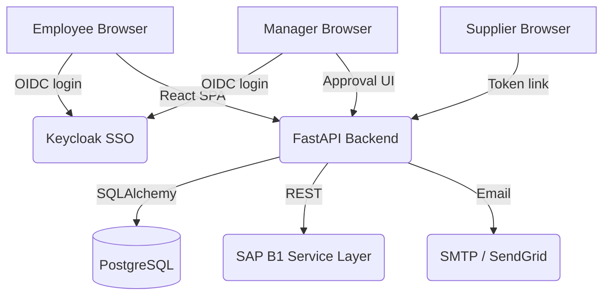

# Architecture — Procure MVP

## Component Diagram

## Data Flow — Full Procurement Cycle

1. **Request creation** — authenticated employee submits purchase request (item, qty, justification)
2. **Approval routing** — system determines approver by cost center and value threshold; sends approval email with one-click approve/reject link
3. **RFQ generation** — approved requests generate RFQ documents; suppliers are invited via email with a unique tokenized URL
4. **Quote submission** — supplier fills in prices and delivery times via public portal (no login); quotes stored against RFQ lines
5. **Comparative map** — buyer views all quotes side-by-side; awards lines to preferred suppliers
6. **SAP B1 sync** — background task creates `PurchaseRequest` document in SAP B1 via Service Layer REST API; status reflected in UI
